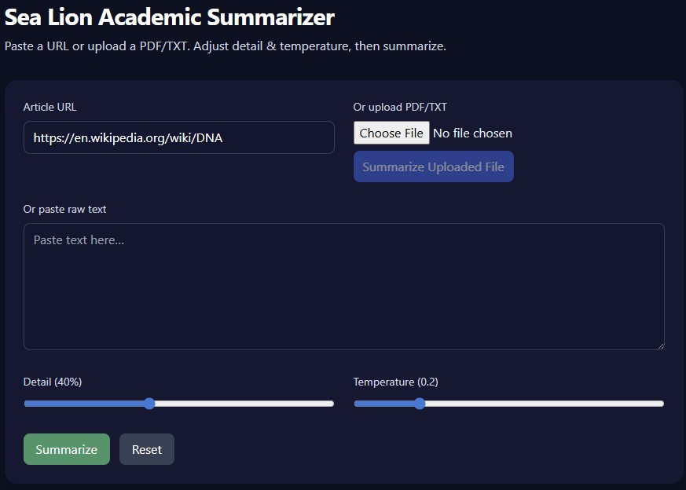

# Sea Lion Academic Summarizer (React + FastAPI)

A modern academic article summarizer with a React (Vite) frontend and a FastAPI backend.
It uses **Sea Lion** as the LLM and **Hugging Face Router** for embeddings, storing vectors in **ChromaDB**.



## Features
- Paste a URL or upload a PDF/TXT file
- Adjustable summary length and temperature
- Modern UI (Vite + React + Tailwind)
- RAG-lite: text is chunked, embedded with HF Router (`sentence-transformers/all-MiniLM-L6-v2`), top chunks selected via MMR, then summarized with Sea Lion
- Ready for Render: `render.yaml` includes a static site for the frontend and a web service for the backend

## Quick start (local)

### 1) Backend
```bash
cd backend
python -m venv .venv && source .venv/bin/activate  # Windows: .venv\Scripts\activate
pip install -r requirements.txt

# create .env from example and fill secrets
cp .env.example .env

# start
uvicorn app.main:app --host 0.0.0.0 --port 8000 --reload
```

### 2) Frontend
```bash
cd frontend
npm i
# set API base if needed:
# echo 'VITE_API_BASE_URL="http://localhost:8000"' > .env.local
npm run dev
```

## Deploy on Render (recommended)

1. Push this folder to a new GitHub repo.
2. In Render, create a **Web Service** from the `backend` directory (Python). Add a **Persistent Disk** (at least 1GB) mounted at `/data` for Chroma.
3. Create a **Static Site** from the `frontend` directory.
4. Add these **Environment Variables** to the backend service:
   - `SEA_LION_API_KEY`
   - `HUGGINGFACE_API_TOKEN`
   - (optional) `CHROMA_DB_DIR` – default `/data/chroma_lessons`
5. The `render.yaml` is provided for reference; you can use it directly or configure services via the UI.

## Environment variables

Backend `.env`:
```
SEA_LION_API_KEY=your_sealion_key
HUGGINGFACE_API_TOKEN=your_hf_token
SEA_LION_BASE_URL=https://api.sea-lion.ai/v1/chat/completions
DEFAULT_SEALION_MODEL=aisingapore/Gemma-SEA-LION-v3-9B-IT
HF_EMBED_MODEL=sentence-transformers/all-MiniLM-L6-v2
HF_EMBED_API=https://router.huggingface.co/hf-inference/models/sentence-transformers/all-MiniLM-L6-v2/pipeline/feature-extraction
CHROMA_DB_DIR=/data/chroma_lessons
```

## API

### `POST /api/summarize`
JSON body:
```json
{
  "url": "https://example.com/article",    // optional
  "text": "Raw text here...",              // optional
  "detail": 40,                            // 0..100
  "temperature": 0.2
}
```
Returns:
```json
{
  "title": "...",
  "summary": "...",
  "chunks_used": [0, 3, 5],
  "stats": {"chunks_total": 12, "chunks_used": 6}
}
```

## Notes
- PDFs are parsed via `pypdf`. For complex PDFs you may want to switch to `pymupdf` or `pdfminer.six`.
- The Sea Lion API is used in an OpenAI-compatible `chat/completions` style payload.
- The Hugging Face Router Feature Extraction endpoint is used to compute embeddings (Authorization Bearer token required).
